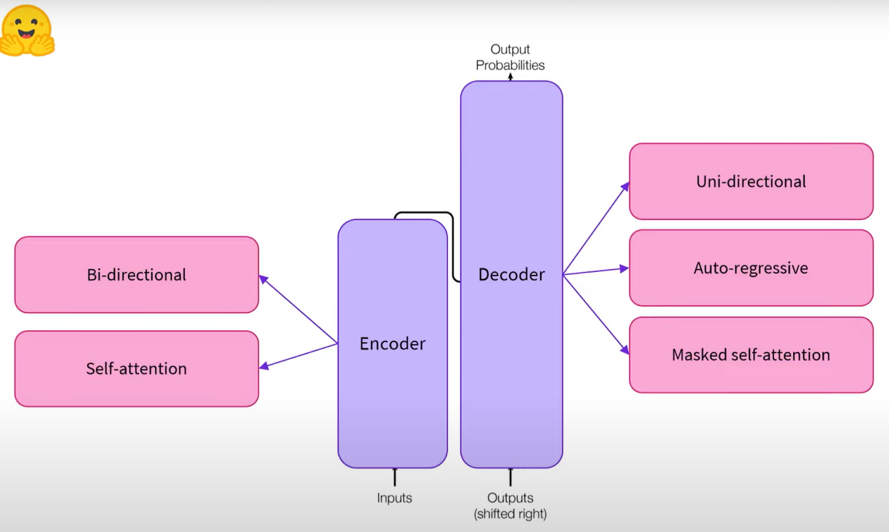
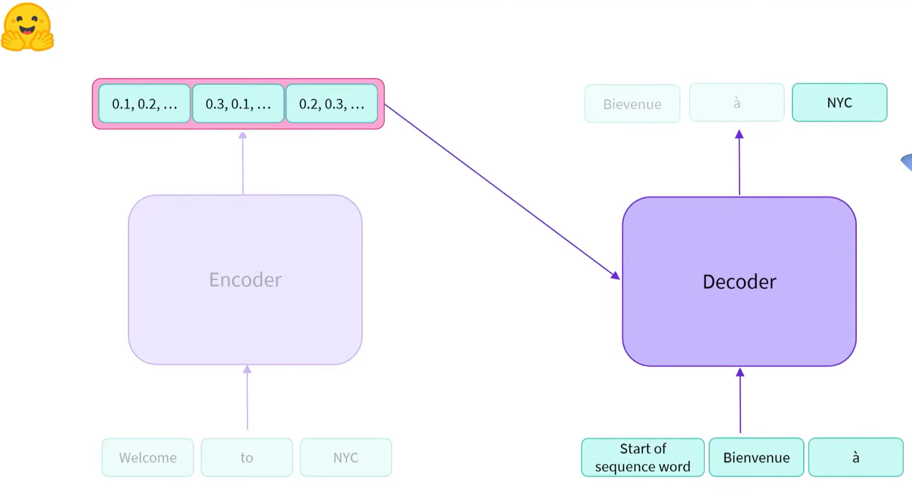
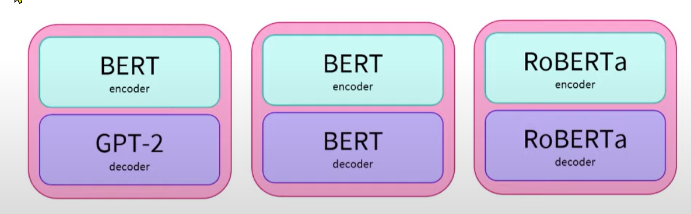

# General notes on chapter 1 - Transformer Models

## History

«The Transformer architecture was introduced in June 2017. The **focus of the original research was on translation tasks**. This was followed by the introduction of several influential models, including:

- June 2018: **GPT**, the first pretrained Transformer model, used for fine-tuning on various NLP tasks and obtained state-of-the-art results

- October 2018: **BERT**, another large pretrained model, this one designed to produce better summaries of sentences

- February 2019: **GPT-2**, an improved (and bigger) version of GPT that was not immediately publicly released due to ethical concerns

- October 2019: **DistilBERT**, a distilled version of BERT that is 60% faster, 40% lighter in memory, and still retains 97% of BERT’s performance

- October 2019: **BART and T5**, two large pretrained models using the same architecture as the original Transformer model (the first to do so)

- May 2020, **GPT-3**, an even bigger version of GPT-2 that is able to perform well on a variety of tasks without the need for fine-tuning (called zero-shot learning)

This list is far from comprehensive, and is just meant to highlight a few of the different kinds of Transformer models. Broadly, they can be grouped into three categories:

- **GPT-like** (also called **auto-regressive** Transformer models)
    - Generative Pre-trained Transformer 2 (GPT-2) is an open-source artificial intelligence large language model created by OpenAI in February 2019. GPT-2 translates text, answers questions, summarizes passages, and generates text output on a level that, while sometimes indistinguishable from that of humans, can become repetitive or nonsensical when generating long passages. It is a general-purpose learner; it was not specifically trained to do any of these tasks, and its ability to perform them is an extension of its **general ability to accurately synthesize the next item in an arbitrary sequence**. GPT-2 was created as a "direct scale-up" of OpenAI's 2018 GPT model ("GPT-1"), with a ten-fold increase in both its parameter count and the size of its training dataset.
    - GPT-2 has a generative pre-trained transformer architecture which implements a DNN, specifically a transformer model, which uses attention in place of previous recurrence- and convolution-based architectures. Attention mechanisms allow the model to selectively focus on segments of input text it predicts to be the most relevant. This model allows for greatly increased parallelization, and outperforms previous benchmarks for RNN/CNN/LSTM-based models.

- **BERT-like** (also called **auto-encoding** Transformer models)
    - BERT = Bidirectional Encoder Representations from Transformers - https://en.wikipedia.org/wiki/BERT_(language_model)
    - Two model sizes: (1) BERTBASE: 12 encoders with 12 bidirectional self-attention heads totaling 110 million parameters, and (2) BERTLARGE: 24 encoders with 16 bidirectional self-attention heads totaling 340 million parameters.
    - BERT is based on the transformer architecture. Specifically, BERT is composed of Transformer **encoder** layers.
    - The high performance of the BERT model could also be attributed to the fact that it is bidirectionally trained. This means that BERT, based on the Transformer model architecture, applies its self-attention mechanism to learn information from a text from the left and right side during training, and consequently gains a deep understanding of the context. For example, the word fine can have two different meanings depending on the context (I feel fine today, She has fine blond hair). BERT considers the words surrounding the target word fine from the left and right side.
    - However it comes at a cost: **due to encoder-only architecture lacking a decoder, BERT can't be prompted and can't generate text**, while bidirectional models in general do not work effectively without the right side, thus being difficult to prompt, with even short text generation requiring sophisticated computationally expensive techniques.
    - Context-free models such as word2vec generate a **single word embedding representation for each word in the vocabulary**, where BERT takes into account the context for each occurrence of a given word. For instance, whereas the vector for "running" will have the same word2vec vector representation for both of its occurrences in the sentences "He is running a company" and "He is running a marathon", BERT will provide a **contextualized embedding** that will be different according to the sentence.
    - https://en.wikipedia.org/wiki/GPT-2#/media/File:Full_GPT_architecture.png

- **BART/T5-like** (also called **sequence-to-sequence** Transformer models)»

 **Self-supervised**  = objective is computed from the inputs to the model / no labelling needed.

- «This type of model develops a statistical understanding of the language it has been trained on, but it’s not very useful for specific practical tasks. Because of this, the **general pretrained model then goes through a process called transfer learning. During this process, the model is fine-tuned in a supervised way — that is, using human-annotated labels — on a given task.**»

- «An example of a task is predicting the next word in a sentence having read the n previous words. This is called *causal language modeling* because the output depends on the past and present inputs, but not the future ones. Another example is *masked language modeling*, in which the model predicts a masked word in the sentence.»

- **"Pretraining"** = training a model from scratch, from randomly initialized weights. Requires a lot of data and compute. «**Fine-tuning**, on the other hand, is training done after a model has been pretrained. To perform fine-tuning, you first acquire a pretrained language model, then perform additional training with a dataset specific to your task.»

## Transformer notes from From wikipedia - https://en.wikipedia.org/wiki/Transformer_(machine_learning_model)

- Replaced RNN's such as LTSM's, and are much more paralelisable.

### Input

The input text is parsed into tokens by a byte pair encoding tokenizer, and each token is converted via a word embedding into a vector. Then, positional information of the token is added to the word embedding.

*(Nota: como é este embedding calculado? isto deve ser tipo word2vec, ou seja, um embedding pré-treinado, certo?)*

### Encoder/decoder architecture

Like earlier seq2seq models, the original Transformer model used an encoder/decoder architecture. The encoder consists of encoding layers that process the input iteratively one layer after another, while the decoder consists of decoding layers that do the same thing to the encoder's output.

The function of each encoder layer is to generate encodings that contain information about which parts of the inputs are relevant to each other. It passes its encodings to the next encoder layer as inputs. Each decoder layer does the opposite, taking all the encodings and using their incorporated contextual information to generate an output sequence. To achieve this, each encoder and decoder layer makes use of an attention mechanism.

For each part of the input, attention weighs the relevance of every other part and draws from them to produce the output. Each decoder layer has an additional attention mechanism that draws information from the outputs of previous decoders, before the decoder layer draws information from the encodings.

Both the encoder and decoder layers have a feed-forward neural network for additional processing of the outputs and contain residual connections and layer normalization steps.

## Transformers General Architecture

Transformer has:

- **Encoder** (left block): converts text into embeddings/"features". Uses "Self-Attention" mechanism. It's Bidirectional. *This part of the model is optimized to acquire **understanding from the input***.
- **Decoder** (right block, receives from Encoder - decodes the encoder representations). Can also accept text as inputs, but it's unidirectional, auto-regressive (i.e., the outputs are used in future interactions), and uses "masked self attention". Generates output probabilities.  *The decoder uses the encoder’s representation (features) along with other inputs to generate a target sequence. This means that the model is optimized for **generating outputs**.*

They can be used together or separately. Combination of two parts is called an "encoder-decoder", or a "sequence-to-sequence" transformer.

### Notes on Attention layers

«A key feature of Transformer models is that they are built with special layers called attention layers. This layer will tell the model to *pay specific attention to certain words in the sentence you passed it (and more or less ignore the others) [e.g., as it generates every output word]* when dealing with the representation of each word.".

«The same concept applies to any task associated with natural language: a word by itself has a meaning, but that meaning is deeply affected by the context, which can be any other word (or words) before or after the word being studied.»

### Original architecture

«The Transformer architecture was originally designed for **translation**.* During training, the encoder receives inputs (sentences) in a certain language, while the decoder receives the same sentences in the desired target language*. In the encoder, the attention layers can use all the words in a sentence (since, as we just saw, the translation of a given word can be dependent on what is after as well as before it in the sentence). The decoder, however, works sequentially and can only pay attention to the words in the sentence that it has already translated (so, only the words before the word currently being generated). For example, when we have predicted the first three words of the translated target, we give them to the decoder which then uses all the inputs of the encoder to try to predict the fourth word.»

«To speed things up during training (when the model has access to target sentences), the decoder is fed the whole target, but it is not allowed to use future words. For instance, when trying to predict the fourth word, the attention layer will only have access to the words in positions 1 to 3.»

The original Transformer architecture looked like this:

«Note that the first attention layer in a decoder block pays attention to all (past) inputs to the decoder, but the second attention layer uses the output of the encoder. *It can thus access the whole input sentence to best predict the current word*. This is very useful as different languages can have grammatical rules that put the words in different orders, or some *context provided later in the sentence may be helpful to determine the best translation of a given word*.

«The attention mask can also be used in the encoder/decoder to prevent the model from paying attention to some special words — for instance, the special padding word used to make all the inputs the same length when batching together sentences.» 
- *Jota: what is the "attention mask"?*

### Terminology: Architecture vs Checkpoints

- *Architecture*: This is the definition of each layer and each operation that happens within the model.
- *Checkpoints*: These are the *weights* that will be loaded in a given architecture.
Model: This is an umbrella term that is- n’t as precise as “architecture” or “checkpoint”: it can mean both.

«For example, *BERT* is an architecture while `bert-base-cased`, a set of weights trained by the Google team for the first release of BERT, is a checkpoint. However, one can say “the BERT model” and “the `bert-base-cased` model.”»

## Encoder models ("auto-encoding models")

- Encoder models use only the encoder of a Transformer model
- Left side of the Transformer architecture, transforms N words into N vectors of numbers (feature vector/tensor)
- Each vector (i.e., word representation) depends on the 'context', i.e. the words that surround it, it's not like a simple dictionary lookup. This happens through the attention mechanism, where «at each stage, the attention layers can access all the words in the initial sentence».
- «The pretraining of these models usually revolves around corrupting a given sentence (for instance, by masking random words in it) and tasking the model with finding or reconstructing the initial sentence.»
- «Encoder models are best suited for tasks requiring an understanding of the full sentence, such as sentence classification, named entity recognition (and more generally word classification), and extractive question answering.»
- They are said to be 'bidirectional' because the calculation of the vectors looks in both directions, left and right of the word that's being encoded.

Google’s `BERT` is (or was?) the most popular Encoder model \[architecture\], others being `ALBERT`, `DistilBERT`, `ELECTRA` or `RoBERTa`.

## Decoder models ("auto-regressive models")

- **Note**: In statistics, econometrics and signal processing, an autoregressive model is a representation of a type of random process; as such, it is used to describe certain time-varying processes in nature, economics, behavior, etc. The autoregressive model specifies that *the output variable depends linearly on its own previous values and on a stochastic term (an imperfectly predictable term)*. 

- Very similar to the Encoder models, it also generates 1 vector of numbers for each word. However each vector for each word only considers the words that came before, the ones that come later are 'masked' and not considered -- it uses "*masked self-attention*".
- «Best suited for text generation tasks - causal language modeling»
- **Auto-regressive** means that previous outputs are used as inputs of the following steps. For example, if we had the word "My", calculated a vector from it, determined (not sure how yet) the next word was "name", then "My name" is fed back to the decoder, but the vector for "My" doesn't have to recalculated (note: not sure if it's modified, however) -- so the model has memory of the previously generated words.

`GPT-2` is an example of a decoder model, with context size of 1024, meaning it can generate text up to this word length while retainig memory of the first words of the generated sequence.

## Sequence-to-sequence models

The name comes from the fact that they "convert" sequences of text into other sequences of text (translation, summarization, etc.).

How it works:

1. first step: words --» encoder --» vectors + "start of sequence indicator" --» decoder --» WORD_1 
1. subsequent steps use only the *decoder* (and the previous outputs of the encoder, but it doesn't need to be run again), and use the generated word (WORD_1) as the start of the sequence, and soi-on and soi-on to generate WORD_2, etc., until e.g. a stop character is generated (like a ".") or a limit is reached.

So the encoder is used once (to generate a representation of the entire input), but the decoder is used several times to generate the output word per word -- using both the "representation of the entire input", and the masked attention -- previously generated words. The weights are not shared across encoder and decoder.

Additionally, the encoder and decoder do not need to have the same context sizes. For example for summarization, the decoder usually has a larger context than the encoder.

These models are best suited for tasks involving generation of new sentences depending on a given input, such as *summarization, translation, or generative question answering*.

`T5`, `BART`, `Marian` are examples.

Some combinations ("proven to work well together") could be:

