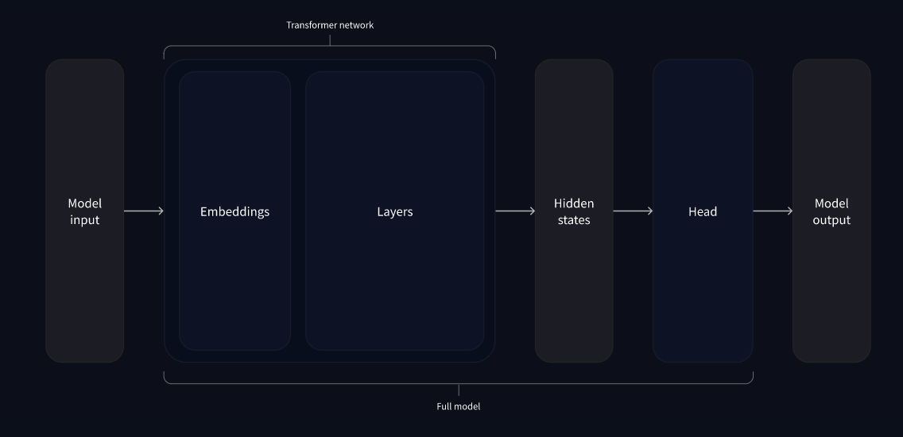

# General notes on chapter 2 - Using Transformers

## Introduction

«The library’s main features are:

- Ease of use: **Downloading, loading, and using a state-of-the-art NLP model for inference can be done in just two lines of code**.

- Flexibility: At their core, **all models are simple PyTorch nn.Module or TensorFlow tf.keras.Model classes** and can be handled like any other models in their respective machine learning (ML) frameworks.

- Simplicity: Hardly any abstractions are made across the library. **The “All in one file” is a core concept: a model’s forward pass is entirely defined in a single file**, so that the code itself is understandable and hackable.

The tokenizer API is the other main component of the `pipeline()` function. **Tokenizers take care of the first and last processing steps, handling the conversion from text to numerical inputs for the neural network, and the conversion back to text when it is needed**. Finally, we’ll show you how to handle sending multiple sentences through a model in a prepared batch, then wrap it all up with a closer look at the high-level `tokenizer()` function.

## Note on Softmax

The softmax function is a mathematical function that converts a vector of real numbers into a vector of probabilities that add up to 1. It is often used in machine learning models, such as neural networks, to perform multi-class classification.

The softmax function works by applying the exponential function to each element of the input vector, and then dividing each element by the sum of all the exponentials. This way, **each element becomes a positive number between 0 and 1, and the whole vector sums to 1**. **The softmax function can be seen as a way of assigning probabilities to different possible outcomes or classes**.

For example, suppose a neural network outputs a vector of three real numbers: (-0.62, 8.12, 2.53). These numbers are not probabilities, and they can be negative or larger than 1. To convert them into probabilities, we can apply the softmax function:

- First, we calculate the exponential (e^x) of each element: (0.54, 3354.73, 12.55).
- Second, we calculate the sum of all the exponentials: 3367.82.
- Third, we divide each element by the sum: (0.00016, 0.9962, 0.0037).

The result is a vector of probabilities: (0.00016, 0.9962, 0.0037). This vector sums to 1, and each element is between 0 and 1. The softmax function has transformed the original vector into a probability distribution that can be interpreted as the confidence of the neural network for each possible class.

## What happens inside the pipeline()

General scheme:


### 1 - Tokenization

Like other neural networks, Transformer models can’t process raw text directly, so the first step of our pipeline is to convert the text inputs into numbers that the model can make sense of. To do this we use a tokenizer, which will be responsible for:

- Splitting the input into words, subwords, or symbols (like punctuation) that are called tokens
- Mapping each token to an integer
- Adding additional inputs that may be useful to the model

All this preprocessing needs to be done **in exactly the same way as when the model was pretrained, so we first need to download that information from the Model Hub**. To do this, we use the `AutoTokenizer` class and its `from_pretrained()` method. Using the checkpoint name of our model, it will automatically fetch the data associated with the model’s tokenizer and cache it.

```
from transformers import AutoTokenizer

checkpoint = "distilbert-base-uncased-finetuned-sst-2-english"
tokenizer = AutoTokenizer.from_pretrained(checkpoint)
```

Once we have the tokenizer, we can directly pass our sentences to it and we’ll get back a dictionary that’s ready to feed to our model! The only thing left to do is to convert the list of input IDs to tensors.

```
raw_inputs = [
    "I've been waiting for a HuggingFace course my whole life.", "I hate this so much!",
]
inputs = tokenizer(raw_inputs, padding=True, truncation=True, return_tensors="pt") # pt = use pytorch tensors in the return
print(inputs)
```

Output looks like this:

```
{
    'input_ids': tensor([
        [  101,  1045,  1005,  2310,  2042,  3403,  2005,  1037, 17662, 12172, 2607,  2026,  2878,  2166,  1012,   102],
        [  101,  1045,  5223,  2023,  2061,  2172,   999,   102,     0,     0,     0,     0,     0,     0,     0,     0]
    ]), 
    'attention_mask': tensor([
        [1, 1, 1, 1, 1, 1, 1, 1, 1, 1, 1, 1, 1, 1, 1, 1],
        [1, 1, 1, 1, 1, 1, 1, 1, 0, 0, 0, 0, 0, 0, 0, 0]
    ])
}
```

The output itself is a dictionary containing two keys, `input_ids` and `attention_mask`. `input_ids` contains two rows of integers (one for each sentence) that are the unique identifiers of the tokens in each sentence.

### 2 - Apply the model

Download the model's checkpoint (it should be cached already):

```
from transformers import AutoModel

checkpoint = "distilbert-base-uncased-finetuned-sst-2-english"
model = AutoModel.from_pretrained(checkpoint)
```

This architecture contains only the base Transformer module: given some inputs, it outputs what we’ll call **hidden states**, also known as **features**. For each model input, we’ll retrieve a *high-dimensional vector representing the contextual understanding of that input by the Transformer model*.

While these hidden states can be useful on their own, *they’re usually inputs to another part of the model, known as the **head***. In Chapter 1, the different tasks could have been performed with the same architecture, but each of these tasks will have a different head associated with it.


The vector output by the Transformer module is usually large. It generally has three dimensions:

- Batch size: The number of sequences processed at a time (2 in our example).
- Sequence length: The length of the numerical representation of the sequence (16 in our example).
- Hidden size: The vector dimension of each model input.

It is said to be “high dimensional” because of the last value (in this case 768).

```
outputs = model(**inputs)
print(outputs.last_hidden_state.shape)
```
Prints out:

```
torch.Size([2, 16, 768])
```

Outputs of Transformers-library models behave like namedtuples/dictionaries. You can access the elements by attributes (like we did) or by key (`outputs["last_hidden_state"]`), or even by index if you know exactly where the thing you are looking for is (`outputs[0]`).

#### Model heads - Making sense out of numbers

*The model heads take the high-dimensional vector of hidden states as input and project them onto a different dimension*. They are usually composed of one or a few linear layers:



The output of the Transformer model is sent directly to the model head to be processed.

In this diagram, the model is represented by its embeddings layer and the subsequent layers. The embeddings layer converts each input ID in the tokenized input into a vector that represents the associated token. The subsequent layers manipulate those vectors using the attention mechanism to produce the final representation of the sentences.

There are many different architectures available in the Transformers library, with each one designed around tackling a specific task. Here is a non-exhaustive list:

- *Model (retrieve the hidden states)
- *ForCausalLM
- *ForMaskedLM
- *ForMultipleChoice
- *ForQuestionAnswering
- *ForSequenceClassification
- *ForTokenClassification

For our example, we will need a model with a sequence classification head (to be able to classify the sentences as positive or negative). So, we won’t actually use the `AutoModel` class, but `AutoModelForSequenceClassification`:

```
from transformers import AutoModelForSequenceClassification

checkpoint = "distilbert-base-uncased-finetuned-sst-2-english"
model = AutoModelForSequenceClassification.from_pretrained(checkpoint)
outputs = model(**inputs)

print(outputs.logits.shape)
```

This prints out: `torch.Size([2, 2])`

### 3 - Postprocessing the output

The values we get as output from our model don’t necessarily make sense by themselves.

```
print(outputs.logits)
```

```
tensor([[-1.5607,  1.6123],
        [ 4.1692, -3.3464]], grad_fn=<AddmmBackward>)
```

Each row on the tensor above represents a sentence, each column represents a possible label (positive or negative). The values in the tensor are called logits, and they represent the model’s predictions for each label. The higher the value, the more likely the model thinks the input sentence is of that label. Remember: Those are not probabilities but logits, the raw, unnormalized scores outputted by the last layer of the model. To be converted to probabilities, they need to go through a SoftMax layer (all Transformers-library models output the logits, as the loss function for training will generally fuse the last activation function, such as SoftMax, with the actual loss function, such as cross entropy):

```
import torch

predictions = torch.nn.functional.softmax(outputs.logits, dim=-1)
print(predictions)
```

```
tensor([[4.0195e-02, 9.5980e-01],
        [9.9946e-01, 5.4418e-04]], grad_fn=<SoftmaxBackward>)
```

So the model predicted 0.04 for the first sentence being negative and 0.96 for it being positive. For the second sentence, it predicted 0.99 for it being negative and 0.0005 for it being positive. To get the labels corresponding to each position, we can inspect the id2label attribute of the model config:

```	
model.config.id2label
```

```	
{0: 'NEGATIVE', 1: 'POSITIVE'}
```	

So we have successfully reproduced the three steps of the pipeline:
- preprocessing with tokenizers
- passing the inputs through the model
-  postprocessing

The following sections go deeper into these topics.

## Models

- The `AutoModel` class and all of its relatives are actually simple wrappers over the wide variety of models available in the library. It’s a clever wrapper as it can automatically guess the appropriate model architecture for your checkpoint, and then instantiates a model with this architecture.

